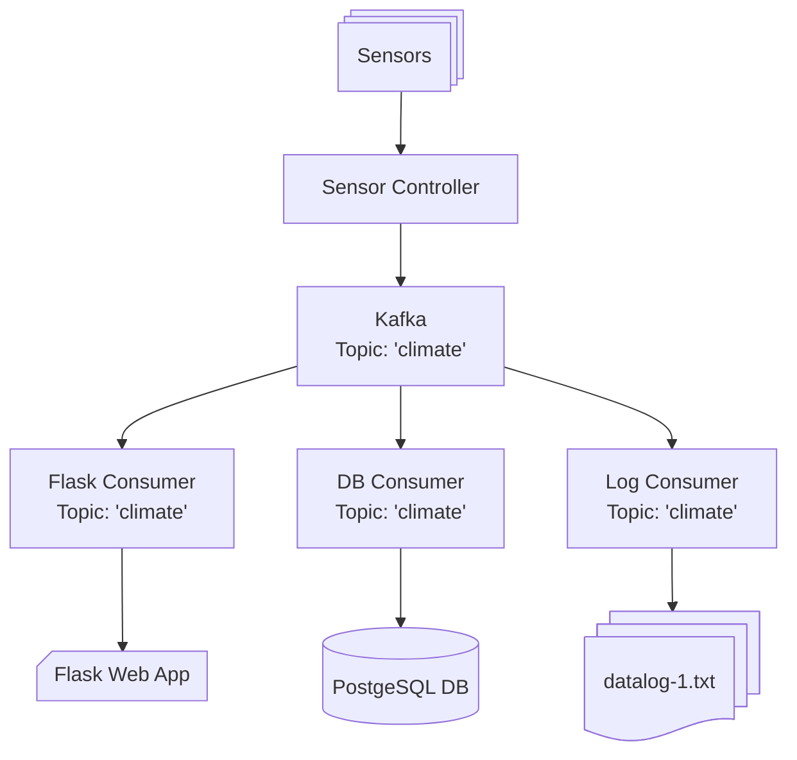

# Mock Micro Climate Monitoring System

## Description

This is a test project created to get some basic understanding of Apache Kafka message broker functionality. 

It is composed of several python applications meant to run in separate Docker containers. One app produces data simulating readings from multiple climate sensors set up in different rooms. 
Currently, the application imitates 6 types of climate sensors:
* Temperature
* Humidity
* Airflow Speed
* Illuminance
* Pressure
* Weight

Python script generates random values from pre-defined range for each sensor and sends it to Kafka. Also there are options to set the sensor offline (which means it will send n/a value) and anomaly (sensor will generate values from far wider range).

Three consumer application receive messages from Kafka: Flask app displays reading online in a web page, Data Base app calculates average parameters for each room every 5 minutes and stores them in Postgres Data Base, Logging app writes the reading to *.txt files (each file contains 2000 records).



## Requirements
* Linux, macOS, or Windows OS with Docker installed.
* Firewall/Network Configuration: Allow necessary ports (e.g., 9092 for Kafka, 5432 for PostgreSQL, 5555 for Flask).

Use the below command to ensure that Docker is installed:
```commandline
docker --version
```

To check the version of Docker Compose use this command:
```commandline
docker-compose --version
```

## Installation

### Project Setup
1. Clone repository:
```commandline
git clone https://github.com/isFrost/iot_simulator.git
cd iot_simulator
```

2. Ensure the following key files and directories are present:
```commandline
├───data_producer
│   │   Dockerfile
│   │   generate.py
│   │   requirements.txt
│   │   __init__.py
│   │
│   ├───controllers
│   │   │   sensor_controller.py
│   │   │   __init__.py
│   │   │
│   │   ├───sensors
│   │   │   │   airflow_sensor.py
│   │   │   │   base_sensor.py
│   │   │   │   humidity_sensor.py
│   │   │   │   illuminance_sensor.py
│   │   │   │   pressure_sensor.py
│   │   │   │   temperature_sensor.py
│   │   │   │   __init__.py
│   │
│   ├───data
│   │       sensors.json
│   │       __init__.py
│   │
│
├───db_consumer
│   │   consume.py
│   │   Dockerfile
│   │   requirements.txt
│   │   __init__.py
│   │
│   ├───controllers
│   │       db_controller.py
│   │       __init__.py
│   │
│   └───data
│           database.ini
│           __init__.py
│
├───flask-app
│   │   Dockerfile
│   │   flask_app.py
│   │   requirements.txt
│   │   __init__.py
│   │
│   └───templates
│           messages.html
│           __init__.py
│
├───flask_consumer
│   │   consume.py
│   │   Dockerfile
│   │   requirements.txt
│   │   __init__.py
│   │
│   └───controllers
│       │   flask_consumer.py
│       │   __init__.py
│       │
└───log_consumer
    │   consume.py
    │   Dockerfile
    │   requirements.txt
    │   __init__.py
    │
    ├───controllers
    │       log_consumer.py
    │       __init__.py
    │
    └───logs
            __init__.py
```
### Steps to Deploy the System

1. Start the Docker containers

```commandline
docker compose up -d
```

2. Verify containers ar running

```commandline
docker container ls
```
3. Stop container when the testing is done:
```commandline
    docker compose down
```

## Operation

All containers with data consuming application are configured so that they started once the container is up and running. On start the apps check that Kafka broker is available. If not they wait 5 seconds and try to connect to Kafka again.

To start the consumer container manually the below commnad can be used. It is applicable for consumer for flask app, consumer for database and consumer for logs.

```commandline
docker exec -it <consumer-container-name> python3 consume.py
```
Data generating script is run manually. It can be done by the following command:

```commandline
dokcer exev -it <producer-container-name> python3 generate.py
```

When the script starts it will generate random values from pre-defined ranges every 5 seconds. To change the default set of simulated sensors updates should be done in sensors.json. It is located in data folder of data_producer app (/data_producer/data/sensors.json).

Onse the generation script starts running the consumer apps should start receiving messages.

### Flask Web App

Flask consuner app receives messages from Kafka broker and send them to Flask App via HTTP protocol with POST method.  Data is send to flask in JSON format.

To check messages in Flask App open the following url in web browser:

```url
http://localhost:5555/messages
```

The web page should display sensor data for each room in different tabs. The room tab should containt the latest average value for eahc climmate parameter folloved by the list of reading from all the sensors of the given parameter. Please see the example below:

```text
Temperature (avg): 23.57 °C [22.78 °C, 25.93 °C, 21.99 °C]
```

Below the caption with average values there should be a scrollable list of the latest 200 readings in the below format:

```text
2024-11-26 16:08:23.317879, Illuminance, Room #1, Sensor #28, Status: on, 589.51 lx
2024-11-26 16:08:23.317968, Illuminance, Room #1, Sensor #29, Status: on, 665 lx
2024-11-26 16:08:28.318820, Temperature, Room #1, Sensor #1, Status: on, 19.23 °C
2024-11-26 16:08:28.319727, Temperature, Room #1, Sensor #2, Status: on, 19.9 °C
2024-11-26 16:08:28.320490, Temperature, Room #1, Sensor #3, Status: on, 18.75 °C
2024-11-26 16:08:28.327636, Humidity, Room #1, Sensor #12, Status: on, 44.06 %
2024-11-26 16:08:28.328243, Humidity, Room #1, Sensor #13, Status: on, 56.12 %
```
Below the scrollable list of reading there are three buttuns: Start, Stop, Export.

* **Start** button resumes receiving micro-climate readings if it has been stopped for the given room before.
* **Stop** button stops recceiving micro-climate readings for the fiven room.
* **Export** button downloads *.txt file with the current 200 lines of readings for the given room.

### Database App

Consumer script for DB app receives messages from Kafka broker, stores them in buffer, calculates average values for each parameter in the room every 5 minutes and sends query to insert average values to PostgreSQL database. 

1. Stored average values can be checked after 5 minutes of running the db consumer script. To check the values enter terminal in the PostgreSQL container:

```commandline
docker exec -it iot_simulator-postgres-1 /bin/bash
```

2. Check the version of PostgreSQL installed in the container:

```commandline
psql --version
```
3. Connect to the database:
```commandline
psql -d sensordata -U db_user
```
4. Check the list of tables in the database for "measurements" tables
```commandline
\dt
```
5. Retrieve the values stored in the database:

```commandline
SELECT * FROM measurements;
```

### Logging App

Consumer script for logging app receives messages from Kafka broker and stores them in *.txt files. Each file contains 2000 records. To check the logs please do the following.

1. In a few minutes after the start of generation script open terminal in the log app container:
```commandline
docker exec -it iot_simulator-log-consumer-1 /bin/bash
```
2. Navigate to logs folder:
```commandline
cd logs
```
3. Check for saved log file(s):
```commandline
ls
```
4. Open log file to check its content:
```commandline
cat datalog-1.txt
```

## Tests

Test Suit 1 - Kafka Producer Tests:

[S1 Producer Tests](manual_tests/S1%20Producer%20Tests.csv)

Test Suit 2 - Kafka Consumer Tests:

TBU

Test Suit 3 - Kafka Broker Tests:

TBU

Test Suit 4 - E2E Tests:

TBU

Test Suit 5 - Performance Tests:

TBU

## Contributions

This is a test project build to improve knowledge of python/selenium automation skills. No contribution is required.

## License

This project is licensed under the MIT License. See the LICENSE file for details.